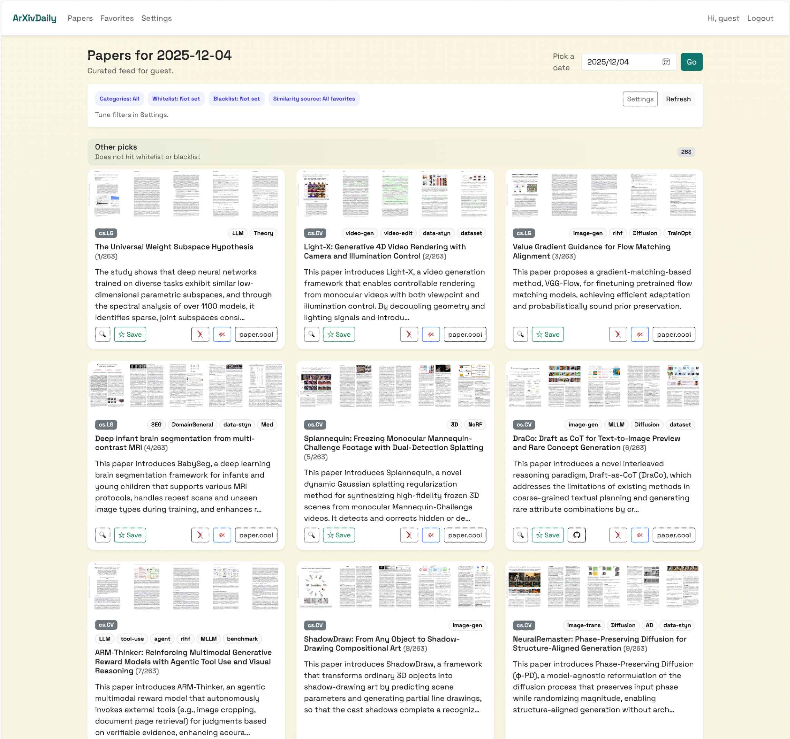

# arXivDaily 📑

<div align="center">

[](https://github.com/caopulan/arXivDaily/stargazers)
[](https://github.com/caopulan/arXivDaily/network/members)

[](https://github.com/caopulan/arXivDaily/blob/main/LICENSE)
[](https://www.python.org/downloads/)
[](https://huggingface.co/datasets/caopu/arXivDaily-data)
[](https://github.com/caopulan/arXivDaily/pulls)

</div>

An elegant, locally deployable tool to browse, filter, and discover the latest ArXiv papers with a modernized card-style interface.


-----

## 📖 Introduction

Staying updated with the latest research should feel as effortless as scrolling through a news-feed app. **arXivDaily** transforms the raw ArXiv feed into a visually engaging, personalized experience.



## ✨ Key Features

### 1. 📱 Immersive Card-Style Browsing

Experience research like never before. Say goodbye to dense text lists and explore papers through an elegant **Card UI** that brings abstracts, authors, and key figures to life.


### 2. 🏷️ Intelligent Paper Analysis

We leverage state-of-the-art LLMs to summarize, tag, and translate every paper, turning raw data into actionable insights.

* **⚡ AI-Powered Tl;dr:** Powered by **DeepSeek V3.2 (Thinking Mode)**, we distill complex papers into a precise one-sentence summary for rapid browsing.
* **🧠 Multi-dimensional Tagging:** Every paper is deeply analyzed and tagged across multiple dimensions—including `task`, `method`, `property`, and `special paper type`—to help you find exactly what you need.
* **🌐 Chinese-Friendly & Bilingual:** Break language barriers with high-quality translations from **Qwen-MT-Plus**. Seamlessly switch between English and Chinese for titles, abstracts, and conclusions.

### 3. 🔖 Smart Collections & Filtering

Don't just read—curate and control your feed.

* **📂 Multi-Folder Favorites:** Organize your research effectively. Create multiple favorite folders to categorize papers by project, topic, or interest.
* **🎯 Context-Aware Recommendations:** The system calculates semantic similarities between new papers and your specific collections, ensuring you never miss relevant research.
* **🎛️ Tag Whitelists & Blacklists:** Take full control of your feed. Set up custom Tag Whitelists to prioritize topics or Blacklists to filter out noise.

### 4. 🏠 Private & Local Deployment

* **🔒 Full Local Control:** Deploy the web interface entirely on your local machine. Your reading history, favorites, and preferences stay private.
* **👥 Flexible User Modes:** Supports multi-user registration and login for shared deployments. For personal use, it defaults to a frictionless "No-User Mode." (Note: Authentication currently uses a lightweight password matching mechanism.)
* **🔄 Effortless Data Sync:** We process and update ArXiv metadata and AI insights daily on the [arXivDaily-data](https://huggingface.co/datasets/caopu/arXivDaily-data) HuggingFace repository. Your local instance can automatically sync with our dataset using a single command/script.


-----

## 🚀 Quick Start

Get up and running in minutes.

### Installation

#### 1.  **Clone the repository**

    ```bash
    git clone https://github.com/yourusername/arXivDaily.git
    cd arXivDaily
    ```

#### 2.  **Install dependencies**

    ```bash
    conda create -n arxivdaily python=3.2
    conda activate arxivdaily
    pip install -r requirements.txt
    
    # Initialize database
    flask --app app init-db
    ```

#### 3.  **Download/Sync Data**

You can download 

a) Download all data without images
```
hf download caopu/arXivDaily-data \
    --include "*.json"\
    --repo-type dataset \
    --local-dir ./arXivDaily-data
```

b) Download specific date data without images

```
hf download caopu/arXivDaily-data \
    --include "2025-12-04.json"\
    --repo-type dataset \
    --local-dir ./arXivDaily-data
```

c) Download specific date data with images

**Note:** Downloading image data requires 1~2GB per day.

Change `--include` to:

```
--include "2025-12-04.json" "images/2025-12-04/*
```

c) Download all data

```
hf download caopu/arXivDaily-data \
    --repo-type dataset \
    --local-dir ./arXivDaily-data
```


#### 4.  **Run the App**

    ```bash
    flask --app app run
    ```

Visit `http://localhost:8501` (or your specific port).

-----

## 🗺️ Roadmap

- [x] Basic Card UI & Responsive Design
- [x] Local Deployment Support
- [ ] Data Mirror: Upload dataset to ModelScope for broader accessibility
- [ ] Open Source Pipeline: Release the code for paper extraction, summarization, and tag processing
- [ ] Mobile Access Guide: Tutorial for deploying on a personal server for remote access via mobile devices
- [ ] Public Web Service: Build an official hosted website.  (We are looking for experts to help us architect a robust public demo. If you are interested, please check the issues or reach out!)

-----

## 🤝 Contributing

Contributions are what make the open-source community such an amazing place to learn, inspire, and create. Any contributions you make are **greatly appreciated**.

1.  Fork the Project
2.  Create your Feature Branch (`git checkout -b feature/AmazingFeature`)
3.  Commit your Changes (`git commit -m 'Add some AmazingFeature'`)
4.  Push to the Branch (`git push origin feature/AmazingFeature`)
5.  Open a Pull Request

-----

## 🤝 Acknowledgement

This project was developed with the help of AI assistants: the core repository is built upon **OpenAI's Codex**, and the GitHub page documentation was generated via **Gemini**.